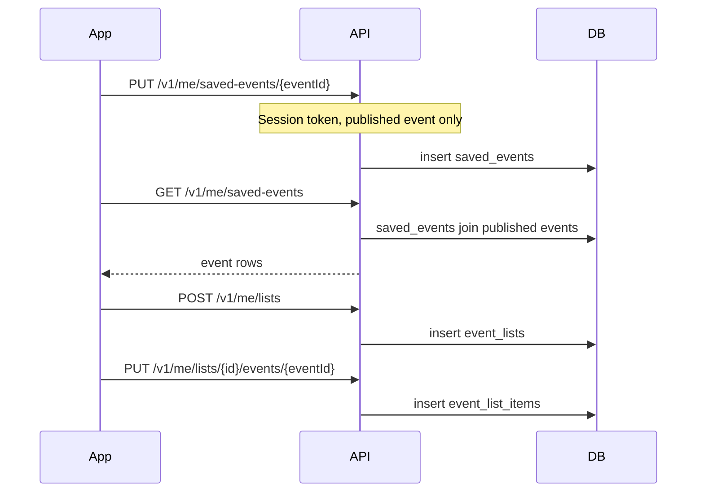

# Saved events and lists

A bookmark is not a notification follow. The mobile app uses the device session.

```mermaid
sequenceDiagram
  participant App
  participant API
  participant DB
  App->>API: PUT /v1/me/saved-events/{eventId}
  Note over API: Session token, published event only
  API->>DB: insert saved_events
  App->>API: GET /v1/me/saved-events
  API->>DB: saved_events join published events
  API-->>App: event rows
  App->>API: POST /v1/me/lists
  API->>DB: insert event_lists
  App->>API: PUT /v1/me/lists/{id}/events/{eventId}
  API->>DB: insert event_list_items
```

Deleting the user cascades `saved_events`, `event_lists`, and `event_list_items`.
